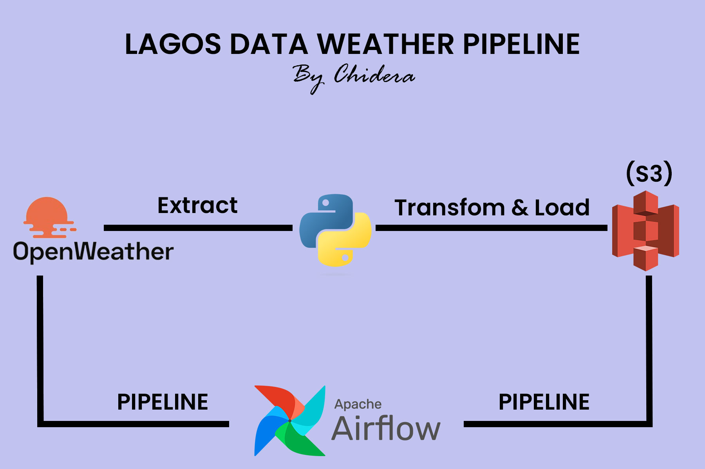

# Lagos Weather Data Pipeline Project

## Overview
The Lagos Weather Data Pipeline project is an automated data pipeline designed to fetch weather data for Lagos from the OpenWeather API, transform it by converting temperatures from Kelvin to Fahrenheit, and finally load the transformed data into an AWS S3 bucket. The entire process is orchestrated using Apache Airflow for automation.

## Project Components
The project consists of the following main components:
1. **Apache Airflow**: Used for workflow orchestration and automation of the data pipeline.
2. **OpenWeather API**: The source of weather data for Lagos.
3. **Data Transformation**: Conversion of temperature data from Kelvin to Fahrenheit.
4. **AWS S3 Bucket**: Destination for storing the transformed weather data.

## Project Workflow

The image above illustrates the workflow of the Lagos Weather Data Pipeline project, showcasing the various stages of data extraction, transformation, and loading.

# Lagos Weather Data Pipeline Project

## Overview
The Lagos Weather Data Pipeline project is an automated data pipeline designed to fetch weather data for Lagos from the OpenWeather API, transform it by converting temperatures from Kelvin to Fahrenheit, and finally load the transformed data into an AWS S3 bucket. The entire process is orchestrated using Apache Airflow for automation.

## Project Components
1. **Apache Airflow**: Used for workflow orchestration and automation of the data pipeline.
2. **OpenWeather API**: The source of weather data for Lagos.
3. **Data Transformation**: Conversion of temperature data from Kelvin to Fahrenheit.
4. **AWS S3 Bucket**: Destination for storing the transformed weather data.

## Pipeline Workflow
1. **Data Extraction**: The pipeline fetches weather data for Lagos from the OpenWeather API.
2. **Data Transformation**: Temperature data is transformed by converting it from Kelvin to Fahrenheit.
3. **Data Loading**: Transformed weather data is loaded into an AWS S3 bucket.

## Project Structure
The project is organized into the following directories and files:
- **dags/**: Contains Apache Airflow DAG definition files.
    - `etl_pipeline.py`: Defines the DAG for the weather data pipeline and includes the transformation script.
- **requirements.txt**: Lists project dependencies required for execution.
- **README.md**: Project documentation providing an overview and setup instructions.

## DAG Definition (etl_pipeline.py)
The `etl_pipeline.py` file defines the DAG for the weather data pipeline, incorporating the following steps:
1. **Data Extraction**: Fetch weather data for Lagos from the OpenWeather API.
2. **Data Transformation**: Convert temperature data from Kelvin to Fahrenheit using the `etl_pipeline.py` script.
3. **Data Loading**: Load transformed weather data into an AWS S3 bucket.

## Setup Instructions
To set up and run the Lagos Weather Data Pipeline project, follow these steps:
1. Install Apache Airflow and its dependencies by running `pip install apache-airflow`.
2. Clone the project repository to your local machine.
3. Navigate to the project directory and install the required dependencies using `pip install -r requirements.txt`.
4. Configure Apache Airflow to connect to your Airflow environment.
5. Copy the `etl_pipeline.py` DAG definition file to the Airflow DAGs directory.
6. Configure the OpenWeather API credentials and AWS credentials in the appropriate environment variables or configuration files.
7. Start the Airflow scheduler and webserver.
8. Trigger the DAG `etl_pipeline` to initiate the data pipeline execution.

## Conclusion
The Lagos Weather Data Pipeline project demonstrates the automation of fetching, transforming, and loading weather data for Lagos using Apache Airflow. By leveraging Airflow's workflow orchestration capabilities, the project provides a robust and scalable solution for managing and automating data pipelines.

